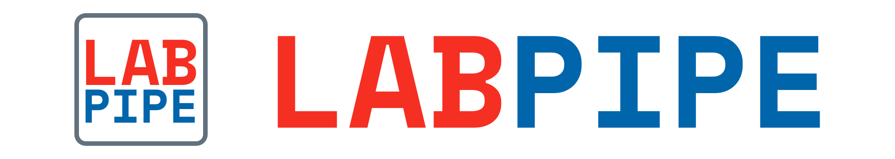

Client to work with LabPipe Server to assist with data collection:

- **dynamic**: server-side form configuration
- **simple**: wizard style step-by-step guide through forms
- **standalone**: server connection only required at first use*

* Server connection is still required if you wish to use functions provided on the server, e.g. notification, backup, and other post upload processes.

## Documentation
The documentation is available [here](http://docs.labpipe.org).

## Roadmap

- [ ] To support more dynamic form field types
- [ ] To support more form validation types
- [ ] To support dynamic form layout
- [ ] To support more built-in form processes
- [ ] To support conditional form dependencies

## License
This project is open  under Non-Profit Open Software License 3.0 (NPOSL-3.0).
